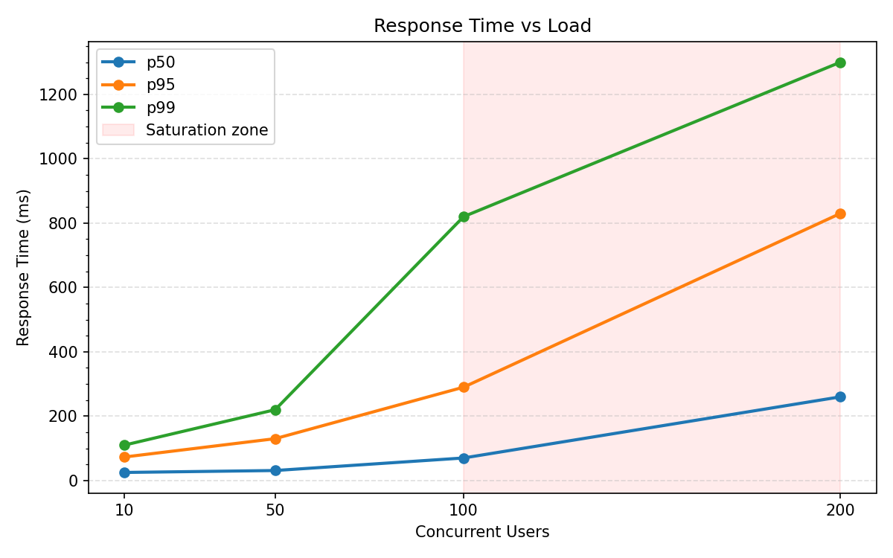
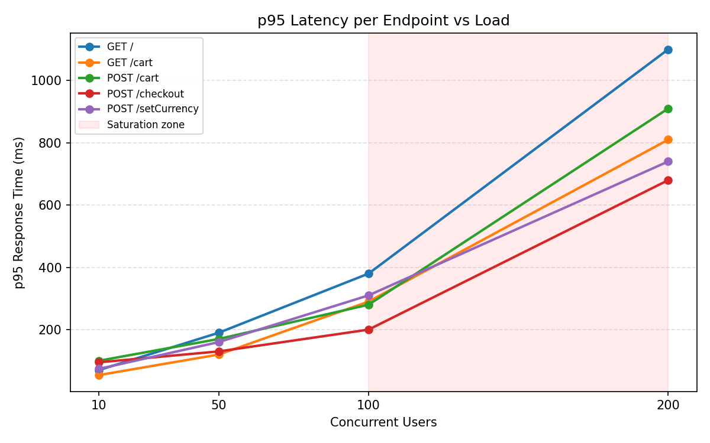
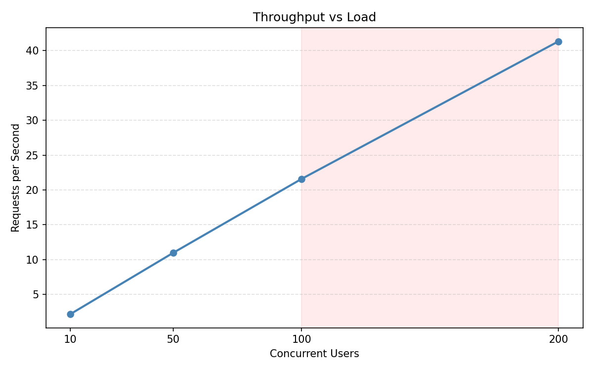

# Performance Evaluation

## Objective

Measure the application's capacity limits under increasing load, identify the
saturation point, and connect the findings back to the CPU resource decisions
made during the Kustomize overlay step.

---

## Methodology

### Tool

Locust, running on the external GCE VM provisioned by Terraform in the same
GCP region as the GKE cluster (`europe-west3-a`). This ensures network latency
between the load generator and the frontend is sub-millisecond and does not
contaminate measurements.

The in-cluster load generator was already disabled (`replicas: 0`) in the
Kustomize overlay, so load test traffic does not compete with application pods
for CPU — measurements reflect actual application performance.

### Locust Configuration

The Ansible playbook was updated to:

- Override the Dockerfile entrypoint to remove `--headless` and add CSV output
- Mount a results volume on the VM at `/opt/locust-results`
- Write `locust_stats.csv` and `locust_stats_history.csv` per run

The entrypoint used:

```
locust --host="http://{{ frontend_addr }}"
       --users={{ locust_users }}
       --spawn-rate={{ locust_spawn_rate }}
       --csv=/results/locust
       --csv-full-history
       --headless
```

Locust configuration is managed through `terraform.tfvars` (`locust_users`,
`locust_spawn_rate`), which Terraform passes into the Ansible inventory via the
`inventory.tpl` template. Changing user count for a new run requires updating
`terraform.tfvars` and re-running the Ansible playbook — no manual SSH required.

### Experiment Design

Four runs were conducted at fixed user counts, each allowed to stabilize before
results were collected. Spawn rate was set to 10% of target user count to ramp
up quickly without creating an unrealistic spike.

| Run | Users | Spawn Rate | Duration |
| --- | ----- | ---------- | -------- |
| 1   | 10    | 1          | ~10 min  |
| 2   | 50    | 5          | ~10 min  |
| 3   | 100   | 10         | ~10 min  |
| 4   | 200   | 20         | ~10 min  |

Results were copied off the VM after each run:

```bash
scp -i ~/.ssh/google_compute_engine \
  debian@<vm-ip>:/opt/locust-results/locust_stats.csv \
  debian@<vm-ip>:/opt/locust-results/locust_failures.csv \
  debian@<vm-ip>:/opt/locust-results/locust_exceptions.csv \
  ./results/<N>users/
```

---

## Results

### Aggregated Metrics Across Runs

| Metric           | 10 users | 50 users | 100 users | 200 users |
| ---------------- | -------- | -------- | --------- | --------- |
| p50 latency      | 25ms     | 31ms     | 70ms      | 260ms     |
| p95 latency      | 73ms     | 130ms    | 290ms     | 830ms     |
| p99 latency      | 110ms    | 220ms    | 820ms     | 1300ms    |
| Throughput (RPS) | 2.18     | 10.97    | 21.58     | 41.32     |
| Failure rate     | 0.028%   | 0.030%   | 0.017%    | 0.025%    |



### Per-Endpoint p95 Latency

| Endpoint            | 10 users | 50 users | 100 users | 200 users |
| ------------------- | -------- | -------- | --------- | --------- |
| GET /               | 70ms     | 190ms    | 380ms     | 1100ms    |
| GET /cart           | 54ms     | 120ms    | 290ms     | 810ms     |
| POST /cart          | 100ms    | 170ms    | 280ms     | 910ms     |
| POST /cart/checkout | 95ms     | 130ms    | 200ms     | 680ms     |
| GET /product/\*     | ~39ms    | ~110ms   | ~290ms    | ~810ms    |
| POST /setCurrency   | 74ms     | 160ms    | 310ms     | 740ms     |



---

## Analysis

### Saturation Point

From 10 → 100 users, throughput scales roughly linearly with user count while
latency grows moderately. At 200 users, throughput continues to scale (21 → 41
RPS) but latency explodes — p50 increases 4x (70ms → 260ms) and p95 increases
3x (290ms → 830ms). This is the definition of saturation: the application is
no longer able to serve additional load proportionally.

The saturation point is approximately **150 concurrent users**, given that the
linear scaling relationship breaks sharply between 100 and 200 users.

### Bottleneck Identification

`POST /cart` shows the clearest degradation signal across runs:

| Run       | p95   |
| --------- | ----- |
| 10 users  | 100ms |
| 50 users  | 170ms |
| 100 users | 280ms |
| 200 users | 910ms |

This points to cartservice as the primary bottleneck. cartservice handles every
cart operation and is called internally by checkoutservice — meaning its
degradation cascades across multiple endpoints.

`POST /setCurrency` also degrades sharply at 200 users (74ms → 740ms p95),
indicating currencyservice is involved in the hot path more than idle metrics
suggested.

### Failure Behaviour

Failures remained at 3-37 across all runs, with no meaningful increase at higher
load. All failures were on `POST /cart/checkout`. This is consistent with a
flaky downstream call inside checkoutservice (payment or email service) rather
than a capacity issue — the failure count does not scale with user count.

---

## Connection to Earlier Decisions

During the Kustomize overlay step, cartservice CPU was halved from 200m to 100m
based on observed idle usage of 8m (4% utilization). The justification was that
cartservice is I/O-bound — its operations are primarily Redis reads and writes,
not compute.

The performance evaluation confirms the idle-based reasoning was correct: at low
load (10-50 users), cartservice performs well within the reduced limit. However,
under sustained load from 100+ concurrent users, the 100m CPU limit becomes a
ceiling. Kubernetes throttles cartservice when it attempts to exceed this limit,
causing request queuing and the latency spike observed at 200 users.

This is the documented cost of the scheduling patch: the CPU request reduction
solved the scheduling problem and was justified by observed usage data, but it
moved the application's saturation point lower than it would be at the original
200m limit.

To push beyond ~150 concurrent users, the options are:

- Increase cartservice CPU limit (simplest — raises the ceiling)
- Enable HPA on cartservice (scales horizontally when CPU pressure is detected)
- Both (HPA with a higher per-pod limit for maximum headroom)

---

## Observations on Monitoring

During load test runs, the following Grafana dashboards provided the
infrastructure-level view that explains the Locust results:

- **Kubernetes / Compute Resources / Namespace (Workloads)** — shows per-service
  CPU utilization. At 200 users, cartservice CPU visibly approaches its 100m
  request limit.
- **Node Exporter / USE Method / Node** — confirms node-level CPU utilization
  remains below saturation. The bottleneck is at the pod limit, not the node —
  meaning horizontal scaling would be effective.

The two data sources together tell the complete story: Locust shows _what_ the
client experiences, Grafana shows _why_ at the infrastructure level.


